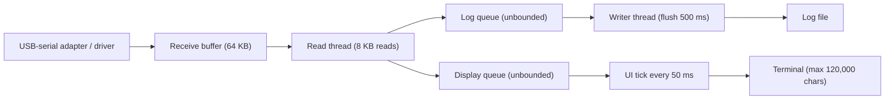

# ViLogger — Limits & Pitfalls

Applies to **ViLogger v1.1.2** and later. Numbers assume **8N1** framing (10 bits per byte), so
**bytes/s ≈ baud ÷ 10** — e.g. 115200 baud ≈ 11.5 KB/s, 921600 baud ≈ 92 KB/s.

> [!IMPORTANT]
> **The log file is the record. The terminal is only a live preview.** The terminal drops old text,
> merges/reformats line breaks and hides non-printable bytes. Always judge correctness from the log file.

---

## 1. Data path at a glance

The log path and the display path are independent: a slow or paused terminal never affects the log.

---

## 2. Summary of hard limits

| Item | Limit | Where it matters |
|---|---|---|
| Ports open at once | **4** | Add Port is disabled at 4 |
| Baud rate | Any whole number **50 – 20,000,000** (list offers 9600 … 921600) | The adapter/driver must support the rate, otherwise Connect fails |
| Data bits | 5–8 | Invalid combos (e.g. 5 data bits + 2 stop bits) fail at Connect |
| Receive buffer | 64 KB | Tolerates ~0.7 s of read stall at 921600, ~5.7 s at 115200 |
| Read chunk | up to 8 KB per read | A chunk is whatever the driver delivered, not a "message" |
| Log queue | **Unbounded** (RAM) | Never drops data; RAM grows if the disk is slower than the port |
| Log flush | every **500 ms** (64 KB file buffer) | Data at risk if the app is killed / PC loses power |
| Terminal text | **120,000 chars**, trimmed to 80,000 | See §4 — only seconds of data at high baud |
| UI refresh | every **50 ms** (20×/s) | Counters and terminal update rate |
| TX write timeout | **500 ms**, 4 KB TX buffer | Large sends at low baud fail (§6) |
| Timestamps | **None** (view or log) | Not usable for timing analysis (§7) |
| Log rotation | **None** | One file per session, grows without limit (§3) |

---

## 3. Logging

### What is guaranteed
- **No data is dropped** while logging: every byte received after you press **Log** and before you
  press it again is written, in order.
- **Binary (`.bin`) and ASCII (`.log`) files contain the exact received bytes** — identical content,
  only the extension differs. Nothing is added (no timestamps, no TX, no system messages).
- **Hex (`.log`)** = every byte as 2 uppercase hex digits, space separated, **exactly 16 bytes per line**
  (independent of how the driver split the data). The file is **3× the data size**.
- Closing ViLogger normally waits until all queued data is on disk.

### Limits and pitfalls
| Situation | What happens | How to avoid |
|---|---|---|
| Start / stop boundary | Logging starts with the **next driver chunk** after you click Log. Bytes received before that are not in the file. | Start logging *before* triggering the device. |
| App killed (Task Manager), crash, power loss | Up to ~500 ms (max 64 KB) of the latest data may be missing. On power loss Windows' own disk cache can lose more. | Close the app normally; don't log critical data on a PC that may lose power. |
| Device unplugged / port error | Logging **stops automatically**. Data still inside the adapter/driver is lost. Reconnect is manual, so there is a **gap**. Pressing Log again starts a **new file**. | Check for the HARDWARE REMOVED badge / `[--- … Disconnected ---]` line before trusting a long log. |
| Very long runs | No rotation — the file just grows. **FAT32 USB sticks stop at 4 GB:** at 921600 baud continuous that is ~13 h (Binary/ASCII) or **~4.3 h (Hex)**. | Log to an NTFS drive; prefer Binary/ASCII for long captures. |
| Slow disk (network share, slow USB stick) | Data waits in RAM (no loss), memory use grows. If the drive disappears, the write fails → logging stops with `Log error: …`. | Log to a local disk. |
| Disk full / no permission | Logging stops (or refuses to start) and shows `Log error: …` in the status bar and terminal. | Watch the status bar; don't run from `C:\Program Files`. |

### File naming
Date/time tokens use your PC's **local time**. Characters that are not allowed in file names are replaced with `_`.

| Pitfall | Effect |
|---|---|
| Template without `{port}` + several ports logging in the same second | All ports want the same file; the second port fails with "file is being used by another process". |
| Template without time tokens (e.g. `{port}`) | Every session is **appended** to the same file, with no separator between sessions. |
| Two sessions of the same port started within the same second | Appended to the same file (seamless, but one file instead of two). |
| The active log file is locked | It cannot be opened by other programs until logging stops (by design). |

---

## 4. Terminal (live view)

### How much history you can see
The terminal keeps at most **120,000 characters**; when exceeded it cuts back to **80,000** (at a line break).

| View | Chars per byte | ≈ Data kept | At 115200 baud | At 921600 baud |
|---|---|---|---|---|
| ASCII | 1 | 80–120 KB | **7–10 s** | **~1 s** |
| Hex | 3 | 27–40 KB | **2–3.5 s** | **~0.3–0.4 s** |
| Binary | — | shows only `[Binary data: N bytes]` per 50 ms tick | — | — |

**AutoScroll OFF** freezes the view so you can read/copy, but data keeps arriving and the oldest part is
still trimmed — when you turn AutoScroll back ON, anything older than the window above is gone from the view
(never from the log).

### The view does not show the data exactly
- **ASCII view:** CR, LF and CRLF all become one line break (LF+CR = two breaks). A lone CR used to
  "overwrite" a line (progress bars) appears as a new line. Bytes `< 0x20` (except TAB) and `≥ 0x7F` are
  shown as `.` — **UTF-8 text such as Vietnamese shows as dots**, even though the log file has the correct bytes.
- **TX echoes and system messages always start on a new line**, so an incoming line that was in progress
  gets visually split. The data/log is not split.
- **Changing View** (ASCII/Hex/Binary) affects new data only; text already shown stays in the old format.
- **Clear** empties the view and resets the RX / LOG / TX counters — it does **not** clear or restart the log file.

### Counters
- **RX** = bytes received (updated every 50 ms).
- **LOG** = received bytes written to the file (raw bytes, *not* the size of a Hex file).
  While logging normally, LOG catches up with RX within ~50 ms; if LOG keeps falling behind, the disk is too slow.

---

## 5. Serial settings pitfalls

| Pitfall | Effect |
|---|---|
| Wrong baud / parity / data bits | You get garbage or nothing — **no warning**. Parity, framing, overrun and break errors are **not reported** by ViLogger. |
| **XOn/XOff handshake** with binary data | Bytes `0x11` and `0x13` are treated as flow control by the driver → binary data is corrupted. Use XOn/XOff only for text protocols. |
| RTS/CTS handshake with the CTS line not wired | Receive works, but TX blocks and fails after 500 ms (`Tx Error: …`). |
| Port already open in another program | Connect fails (Windows allows only one owner per COM port). |
| Unusual baud rate | Must be supported by the adapter; some adapters silently round to the nearest supported rate. |

---

## 6. Transmit (TX)

| Item | Behavior |
|---|---|
| ASCII mode encoding | **7-bit ASCII only.** Any non-ASCII character (Vietnamese letters, `°`, `©`, smart quotes…) is sent as `?` (`0x3F`). Use HEX mode to send such bytes. |
| Line ending | Appended **only in ASCII mode**. In HEX mode exactly the typed bytes are sent — add `0D 0A` yourself. |
| HEX input | Must have an even number of digits; otherwise nothing is sent and the status bar shows an error. |
| Size / timeout | 4 KB TX buffer + 500 ms timeout ⇒ roughly **≤ 4.5 KB per send at 9600 baud**, ≤ ~10 KB at 115200. Larger sends fail with `Tx Error`. |
| Logging | TX data is **never written to the log**; it only appears in the terminal as `TX>> …`. |
| TX failure | Does not close the port or stop logging of received data. |

---

## 7. Timing

- **No timestamps** are stored in the log or shown in the view. ViLogger cannot tell *when* a byte arrived,
  inter-byte gaps, or response latency.
- Received data arrives in **driver chunks**: USB-serial adapters batch bytes (FTDI's default latency
  timer is 16 ms; CP210x/CH340 behave similarly). Even the order of chunks between **different ports** is
  only approximate. For timing measurements use a logic analyzer / oscilloscope.
- Closing a port takes up to ~250 ms; unplug detection relies on Windows device notifications and is usually immediate.
